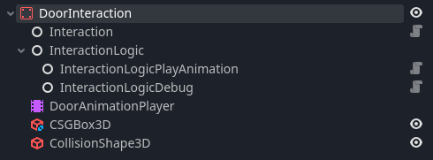
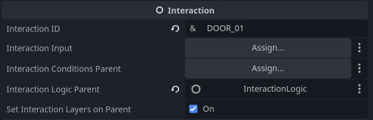
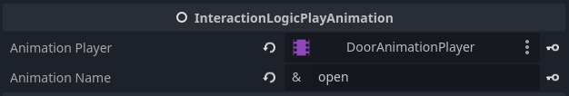
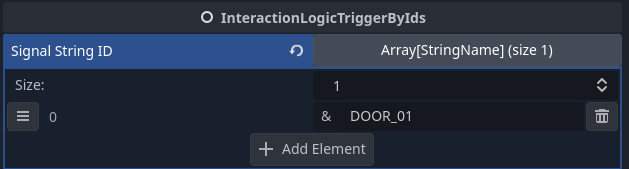

# Example Interactions

## Door Interaction

- You can see as the interaction ID I set it as `DOOR_01`
- This is because I want to trigger the door logic, from an external node that will trigger based on an id, in this case `DOOR_01`

- We want our logic to open the door, so I connected it to the animation player, and referenced the name of the animation I want to play called `open`

- Now we can trigger the door, from an EXTERNAL interaction, like a button or just by using the base interaction prefab.
- And we add the InteractionLogicTriggerByIds Node because we want to trigger the door interaction  by the id of `DOOR_01`
- Notice we can also trigger multiple Interactions!
