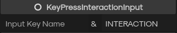

# Interaction Input Type Node
- The input type node will handle all user input related to the interaction.
- Like key presses, stepping into an area, looking at the interaction, etc.

### How to use
1. In the node menu simply search `InteractionInput` and you will see a few options pop up.
2. The most common one you'll use is the `key press` input 

### Input Types

#### Area Interaction Input

- Takes an `Area3D` as an argument, this will represent the area the player needs to step into to trigger the interaction
- You can make it trigger on enter or exit of the area
- Also an optional `Only Player Can Trigger` conditional, if you want other entities to trigger this interaction just uncheck it
