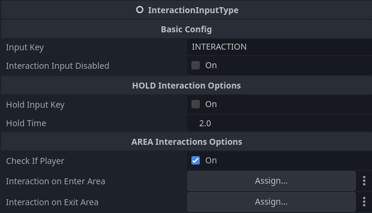

# Interaction Input Type Node
- The input type node will handle all user input relating to the interaction.

### Features
- You can also change the key that you use to interact to trigger the interaction, by default in the project the keys are F and Left-Click
- **Supports** hold interactions, meaning hold key for x amount of time, until the player triggers the Interaction.
- **Supports** area interactions, meaning you can assign an area 3d node, so you can trigger based on if and entity or player enters or exits the area.
