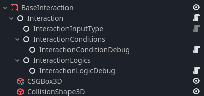
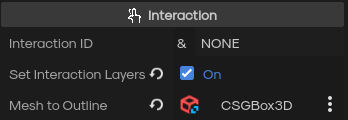

### The Interaction System

## Interaction Overview
- Every interaction has a collection of interaction nodes, and different parts pieces.
- Its important to note that this system is built to be dynamic so you can even put interaction nodes, under any node to active it in some sort of way.
    - A good example of this is in the player node under the camera, there is a Interaction that simply shakes the camera.

## How it works

### Interaction Node

- This nodes references a few other nodes
    1. Parent conditions node
        - Controls weither or not, the interaction can be triggered
        - Every node that extends InteractionCondition class will be checked.
        - If every condition check is passed, the interaction can be triggered by external sources.
    2. Parent logic node
        - All nodes that extend InteractionLogic class, and are a child of this node will be triggered.
    3. InteractionInputType Node
        - Handles all of the player interaction with the node. You can just remove this node, if you do not need player interaction.

