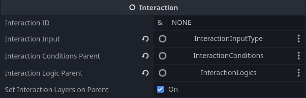

## Interaction Example 
- `InteractionInputs`
    - Contains all the ways the interaction can be triggered by the player
    - In this case the most basic input is attached, `KeyPressInteractionInput` which does as its named. It just triggers off of a key press.
        - Every input key interaction input is defaulted to the `INTERACTION` keymapping. You can see this in the Godot Input Map.
        - The player can change this in the keymapper when playing as well, you can change the default mapping to whatever as well.
    - You can add 0 or more interaction inputs to trigger the interaction.

- `InteractionLogics`
    - I call the functionality and programming of the interaction `InteractionLogics` **this is the thing that makes things do other things** (that sounds like baby talk but thats the best way i can explain it right now lol)
    - After all the [conditions](interaction-conditions.md) are consididered passed and interaction is triggered by a remote call or input then the logics run. There is also an option for a interaction failed logic.
    - Logics are the bread and butter for the interactions, I give you a small tool box of the most needed logics but this is for you to expand as you develop your game. You will most likely need more customized and complex logic nodes for your game. You can find the default logic nodes built in [HERE](interaction-logics.md)

## How it works

### Interaction Node

1. `Interaction ID`
    - This allows us to remotely call the interaction if need be
    - You can do this via the Jitspo in-game debug console using the `~` key, then typing `trigger-id <INTERACTION ID>`. 

2. `Set Interaction Layers`
    - Sets the static objects layers so that the player can interact with the interaction. This must be active for the interaction to be triggered by the player.
    - It does not need to be active, if you intend this interaction to not be triggered by the player, in the traditional sense. This is more for remote calls.
    - The `DEFAULT INTERACTION LAYER` is defaulted to `3` and can be changed within the code. In the `interaction.gd` script, you can change it.
3. `Mesh To Outline`
    - This will add an outline to the object when interactable. This is still being worked on to be more flexable. But good for simple 3D objects. Not tested enough.
