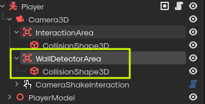

# Walls

- Set a collision object to layer 3, the wall detector on the player scene will see it and block interactions
that happen if it detects a "wall".

- This is so you can do things like safes, and you can interact with something inside the safe once its opened. The issue is, if no "wall" is detected then you can just interact with the object inside the safe. This is why I came up with this solution.

- An alternative is making the object inside the safe a conditional to the safe being opened. But there are a lot of other cases of interactions being behing walls, so we want to minimize cheating.
