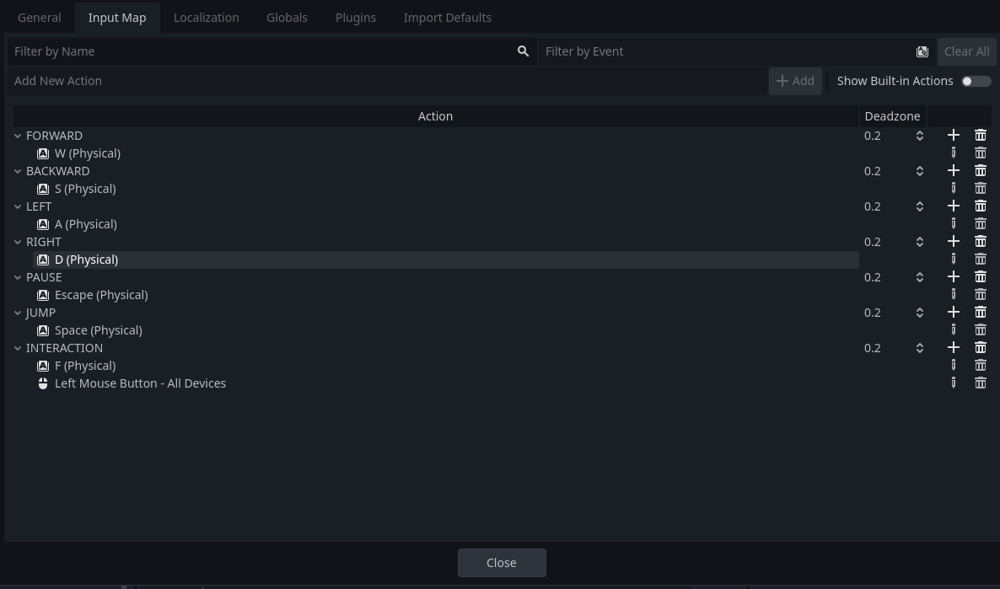
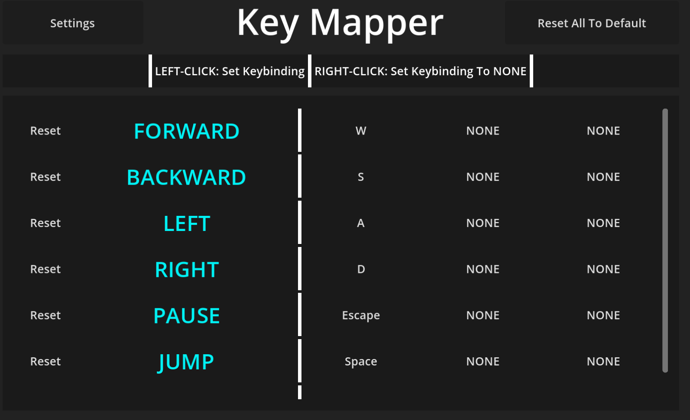

# Key Mapper
- The key mapper is dead simple, and you should not need to modify the code in anyway. So I will tell you how to use it.

## How To Use
- What ever you add to the inputs in godot will automatically be reflected in the key mapper

- The `DEFAULT` keys are automatically mapped to whatever you initially set them to in the Input Map in Godot.
- Every keymapping is automatically saved when exiting and when modifying the inputs
